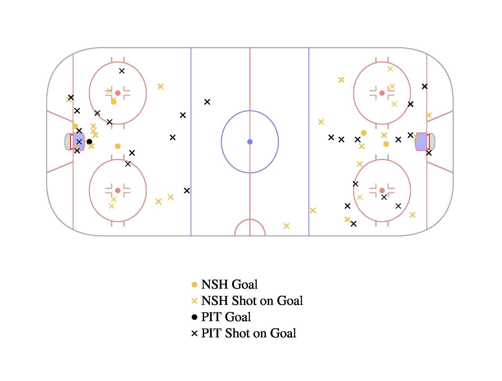
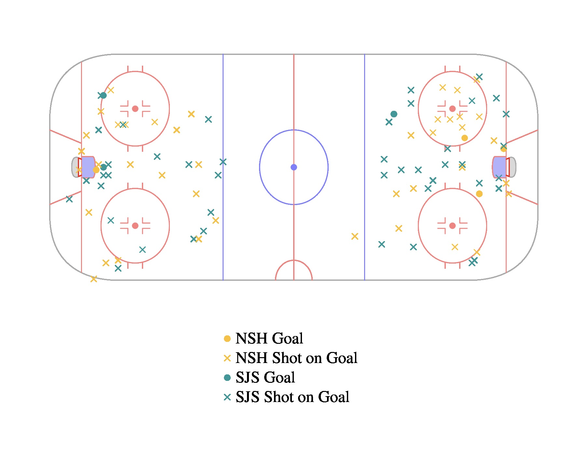
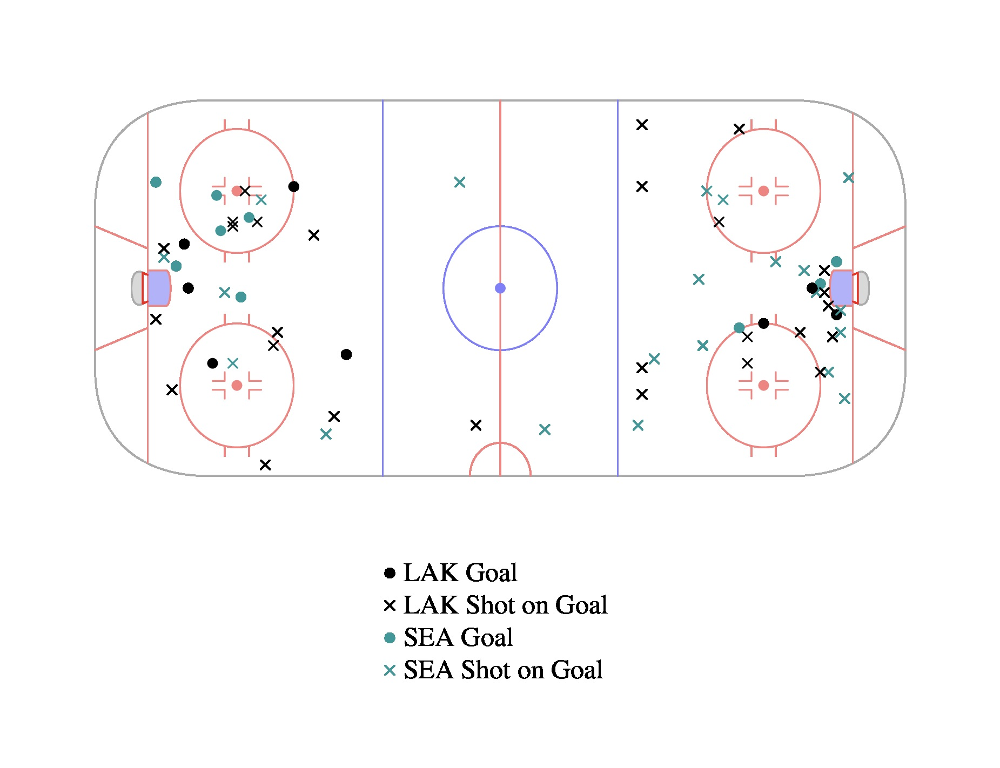
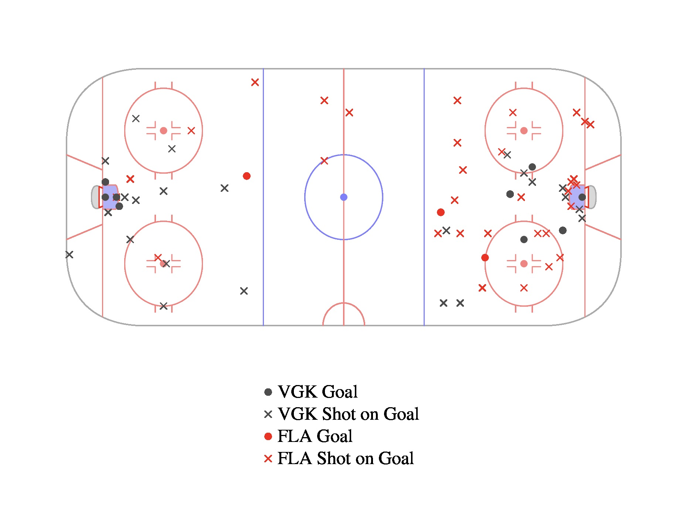

# NHL Shot Mapper

- Eric Vaughan
- COSC 594 (Dr. Plank - Spring 2024)
- Lab 1: Jgraph
- Last Updated: February 2024

## Introduction

The NHL Shot Mapper (NSM) is a tool for visualizing the goals and shots on goal from NHL games that feature current NHL franchises. Upon being provided a team and date of a game, NSM uses an [NHL API](https://github.com/Zmalski/NHL-API-Reference) to find the specified game and then obtain its play-by-play breakdown. For each event that is either a goal or shot on goal, the associated team and location on the ice are recorded. These events are then plotted onto a graph of an ice rink, with circles (•) marking goals and x's (x) marking shots on goal that did not end up as goals.

You build NSM (and five example graphs) with

```
make
```

You run NSM with

```
./nsm [team-abbreviation] [date-of-game] [output-file-name]
```

- **Team abbreviation**: The three letter abbreviation of a current NHL team. A list of these abbreviations is provided further below.
- **Date of game**: This must follow the format of YYYY-MM-DD.
- **Output file name**: The name of the file in which the resulting NHL shot map will visible. Do *not* include a file extension. The output file will automatically be generated as a JPEG.

## Team Abbreviations

| Abbreviation | Team Name
| - | -
| ARI | Arizona Coyotes
| BOS | Boston Bruins
| BUF | Buffalo Sabres
| CAR | Carolina Hurricans
| CBJ | Columbus Blue Jackets
| CGY | Calgary Flames
| CHI | Chicago Blackhawks
| COL | Colorado Avalanche
| DAL | Dallas Stars
| DET | Detroit Red Wings
| EDM | Edmonton Oilers
| FLA | Florida Panthers
| LAK | Los Angeles Kings
| MIN | Minnesota Wild
| MTL | Montreal Canadiens
| NJD | New Jersey Devils
| NSH | Nashville Predators
| NYI | New York Islanders
| NYR | New York Rangers
| OTT | Ottawa Senators
| PHI | Philadelphia Flyers
| PIT | Pittsburgh Penguins
| SEA | Seatle Kraken
| SJS | San Jose Sharks
| STL | St. Louis Blues
| TBL | Tampa Bay Lightning
| TOR | Toronto Maple Leafs
| VAN | Vancouver Canucks
| VGK | Vegas Golden Knights
| WPG | Winnipeg Jets
| WSH | Washington Capitals

## Notes

- If two teams have the same color, the away team's color will be changed to gray.
- Often there will be a couple shots from behind the goal line. This is not a mistake, as players do sometimes try to hit it off of the goalies into the net, forcing the goalies to make a save.

## NSM Examples

Below are five examples of graphs produces by NSM.

First, let's reminisce on the Nashville Predator's run to the Stanley Cup Finals in 2017. Although they lost the series 4-2, they crushed the Pittsburgh Penguins in game 3. Despite Nashville only having a few more shots, they won the game by four goals. They appeared to be very hot from mid-range that night.
```
./nsm NSH 2017-06-03 examples/Nashville-Predators-2017-06-03
```


Continuing with the Nashville Predators, here is a graph from their longest game in franchise history. Considering the game lasted over halfway into the third overtime period, there were lots of shots. All of Nashville's goals came from close range.
```
./nsm NSH 2016-05-05 examples/Nashville-Predators-2016-05-05
```


Next, lets look at the New York Ranger's incredible 4-goal comeback in their Stadium Series game earlier this month. Plenty of shots were taken, with both teams tallying up a similar and large amount of shots. Also, both teams relied heavily on close range goals that night.
```
./nsm NYR 2024-02-18 examples/New-York-Rangers-2024-02-18
```


Another example of a high-scoring game was when the Seattle Kraken took on the Los Angeles Kings in 2022. As typically is the case, a few goals were scored from right in front of the goal. However, one interesting thing about this game pertains to the upper left face-off circle. For some reason, that was a hot spot that night, with four goals being scored from within it.
```
./nsm SEA 2022-11-29 examples/Seattle-Kraken-2022-11-29
```


Lastly, let's examine the game that sealed the title for the current Stanley Cup Champions, the Vegas Golden Knights. In this game, all the Florida Panthers' goals were long range, and Florida actually had more shots than Vegas. Vegas got hot up close, though, and ended up winning by six goals.
```
./nsm VGK 2023-06-13 examples/Vegas-Golden-Knights-2023-06-13
```
